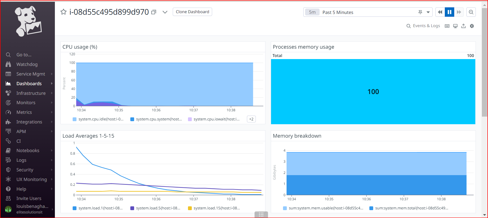
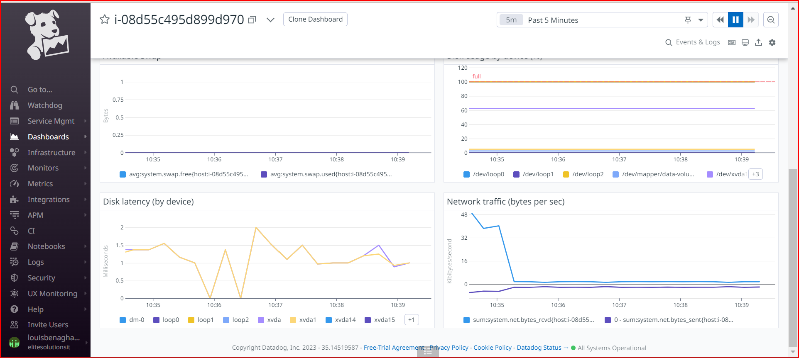

## Execute Playbook

RUN: 
```
ansible-playbook -i <your inventory file or location> < your playbook > -u < user > --private-key < private key name/location > -e @vars.yml -vvv

```

## Step 1/3: Install the datadog role from Ansible Galaxy on your Ansible server.
`ansible-galaxy install datadog.datadog`

## Step 2/3: playbook
```
- hosts: servers
  roles:
    - { role: datadog.datadog, become: yes }
  vars:
    datadog_api_key: ""
    datadog_site: "datadoghq.com"
```

# Step 3/3: Encryt your key befor push.

`ansible-vault encrypt vars.yml `

Basic system dashboard


